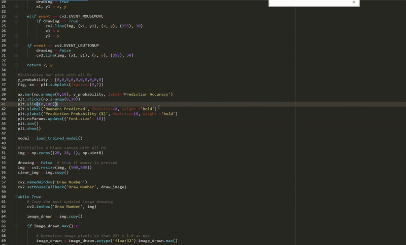

A Deep Learning project using Convolutional Neural Network to predict hand-drawn digits.

The Deep Learning model is trained on the MNIST dataset and implemented using OpenCV (computer vision).

I wrote a blog post on this project here: https://rylu1.com/2020/05/23/mnist/

# Demo of project

